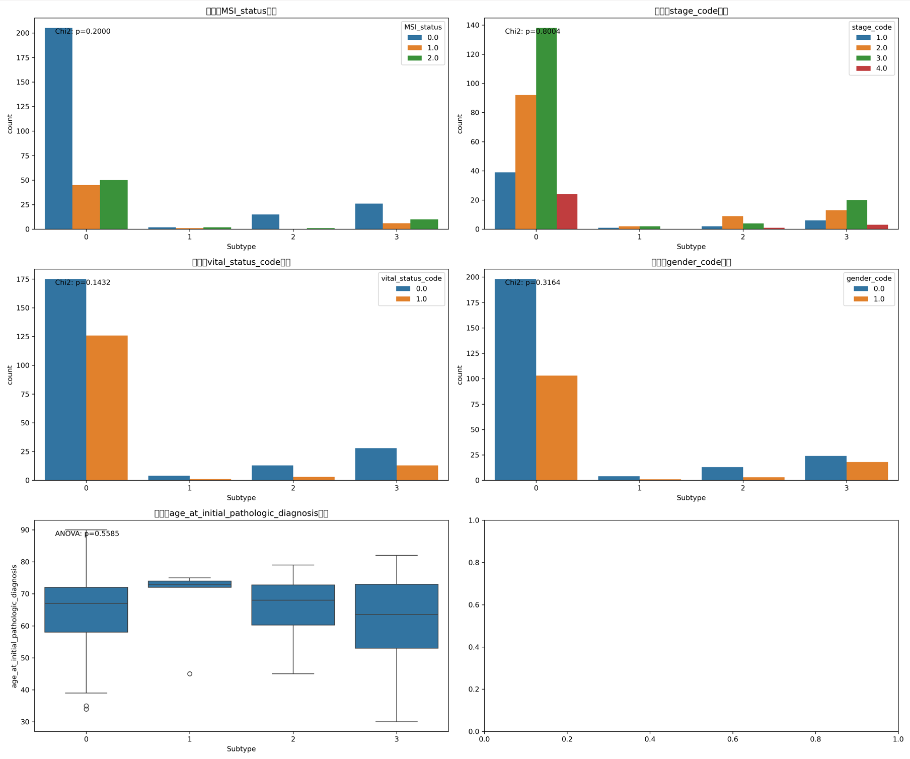

# 胃癌多组学整合分子分型系统实验报告

## 1. 实验目的

​		本实验旨在通过整合多种组学数据（基因表达、DNA甲基化、miRNA表达、拷贝数变异和体细胞突变），建立一个鲁棒的、具有临床意义的胃癌分子分型系统。该系统可用于指导胃癌的精准诊疗和预后预测。

整体工作流程图：

~~~mermaid
graph TD
    A[数据预处理] --> B[特征选择]
    B --> C[单组学分析]
    C --> D[多组学整合]
    D --> E[分子分型确定]
    E --> F[分型特征解析]
    F --> G[预测模型构建]
    G --> H[临床意义验证]
~~~

## 2. 实验数据

### 2.1 数据来源

本研究使用了TCGA-STAD（胃癌）数据集，包含以下组学数据：

- **基因表达数据**：450个样本，1,567个特征
- **DNA甲基化数据**：398个样本，1,991个特征
- **miRNA表达数据**：428个样本，498个特征
- **拷贝数变异(CNV)数据**：441个样本，461个特征
- **体细胞突变数据**：439个样本，88个特征
- **临床表型数据**：包括随访信息和病理特征

临床特征分布图：

### 2.2 数据预处理

各组学数据经过以下步骤处理：

- 缺失值处理
- 标准化转换
- 批次效应校正
- 特征选择（方差过滤、MAD、相关性过滤）

**图片插入：** `results/figures/preprocessing/feature_selection_summary.png`（如果有特征选择结果图）

## 3. 实验方法

### 3.1 单组学聚类

对每种组学数据单独进行聚类分析，使用以下方法：

- K-means聚类
- 层次聚类
- 谱聚类

**图片插入：**

- `results/clustering/expression_clusters_heatmap.png`（基因表达聚类热图）
- `results/clustering/methylation_clusters_heatmap.png`（甲基化聚类热图）

### 3.2 多组学整合

使用SNF（相似性网络融合）方法整合多组学数据：

- 为每个组学构建样本相似性矩阵
- 迭代融合这些网络
- 应用谱聚类确定最终亚型

**图片插入：**

- `results/integration/fused_similarity_matrix.png`（融合相似性矩阵热图）
- `results/integration/integrated_subtypes_mds.png`（多维缩放可视化）

### 3.3 高级聚类组合方法

使用多种聚类算法的组合方法得到更稳定的亚型：

- 比较不同聚类方法结果
- 构建共聚类频率矩阵
- 基于共识矩阵进行最终分类

**图片插入：**

- `results/advanced_clustering/co_occurrence_matrix.png`（共聚类频率矩阵）
- `results/advanced_clustering/final_subtypes_mds.png`（最终亚型MDS可视化）

### 3.4 预测模型构建

构建了用于亚型预测的机器学习模型：

- 特征选择：从各组学中选择最具区分力特征
- 模型训练：SVM和随机森林
- 性能评估：交叉验证和独立测试集

**图片插入：**

- `results/prediction_models/figures/feature_importances.png`（特征重要性图）
- `results/prediction_models/figures/SVM_confusion_matrix.png`（SVM混淆矩阵）

## 4. 结果与分析

### 4.1 多组学整合分型结果

通过多组学整合，我们成功鉴定了4个胃癌分子亚型，样本分布如下：

- **亚型0**：301例(82.7%)
- **亚型1**：5例(1.4%)
- **亚型2**：16例(4.4%)
- **亚型3**：42例(11.5%)

**图片插入：**

- `results/final_report/subtype_overview.png`（亚型分布饼图）
- `results/final_report/integrated_subtypes_mds.png`（亚型MDS图）

### 4.2 亚型分子特征

各亚型展现出独特的分子特征谱：

**亚型0（间质型）**:

- 高表达基因: CHRDL2, C7, PLXNA4, FBLN1, CCL19
- 显著缺失基因: FHIT, GMDS, RBFOX1, FOXP1
- 高频突变基因: FCGBP, RYR3, NBEA, CUBN, PTPRT

**亚型1（MSI型）**:

- MSI-H比例高达40%
- 高表达基因: KIF1A, TMPRSS3, C3orf67等
- 显著扩增基因: CYP4F35P, CHST9, FGF14

**图片插入：**

- `results/molecular_subtypes/figures/expression_subtype_features.png`（基因表达特征热图）
- `results/molecular_subtypes/figures/mutation_subtype_features.png`（突变特征热图）
- `results/molecular_subtypes/figures/methylation_subtype_features.png`（甲基化特征热图）

### 4.3 亚型临床特征关联

各亚型展现出显著不同的临床特征和预后：

- **亚型1**：最佳预后，生存事件率20.0%
- **亚型2**：预后良好，生存事件率18.8%
- **亚型3**：预后中等，生存事件率31.0%
- **亚型0**：预后较差，生存事件率41.2%

**图片插入：**

- `results/molecular_subtypes/figures/survival_analysis.png`（生存曲线图）
- `results/evaluation/figures/clinical_significance.png`（临床相关性图）

### 4.4 预测模型性能

构建了用于亚型预测的机器学习模型：

- **SVM模型**：准确率84.93%
- **随机森林模型**：准确率82.19%

**图片插入：**

- `results/prediction_models/figures/model_performance.png`（模型性能比较图）
- `results/prediction_models/figures/ROC_curves.png`（ROC曲线图，如果有）

## 5. 结果评估

### 5.1 分型鲁棒性

评估了分型系统的稳定性和鲁棒性：

- 不同聚类方法间的一致性
- 参数敏感性分析
- 子样本稳定性测试

**图片插入：**

- `results/evaluation/figures/clustering_methods_ari.png`（聚类方法ARI热图）
- `results/evaluation/figures/robustness_analysis.png`（稳定性分析图）

### 5.2 临床相关性

全面评估了分型系统与临床特征的关联：

- 生存差异统计学分析
- 与重要分子标志物关联（如MSI状态）
- 与病理特征关联

**图片插入：**

- `results/evaluation/figures/clinical_significance.png`（临床相关性分析图）
- `results/molecular_subtypes/figures/msi_status_distribution.png`（MSI状态分布图）

### 5.3 与文献分型比较

将本研究的分型系统与TCGA和ACRG分型系统进行比较：

- 亚型0部分对应TCGA的GS型/ACRG的EMT型
- 亚型1对应MSI型
- 亚型2部分对应CIN型
- 亚型3展现出独特的特征组合

**图片插入：**

- `results/evaluation/figures/subtype_comparison.png`（分型系统比较图）

## 6. 讨论与展望

### 6.1 研究发现

本研究成功建立了具有临床意义的胃癌分子分型系统：

- 多组学整合提供了更全面的分子视角
- 鉴定出具有特征分子模式的四个亚型
- 亚型与患者生存和临床特征显著相关

### 6.2 局限性

本研究存在以下局限性：

- 亚型1和亚型2样本数量较少
- 缺乏独立验证队列
- 功能实验验证有限

### 6.3 未来方向

基于当前研究，我们提出以下未来研究方向：

- 扩大样本规模，尤其是亚型1和亚型2
- 在独立队列中验证分型系统
- 开发简化的临床分型工具
- 探索亚型特异性治疗策略

## 7. 项目分工

本项目由各成员共同完成，具体分工为：

1. 数据预处理与特征选择（20%）
2. 单组学聚类分析（15%）
3. 多组学整合与分型（20%）
4. 亚型特征分析（15%）
5. 预测模型构建（15%）
6. 临床关联分析（10%）
7. 项目统筹与报告撰写（5%）

## 8. 参考文献

1. The Cancer Genome Atlas Research Network. Comprehensive molecular characterization of gastric adenocarcinoma. Nature, 2014.
2. Cristescu R, et al. Molecular analysis of gastric cancer identifies subtypes associated with distinct clinical outcomes. Nature Medicine, 2015.
3. Wang B, et al. Similarity network fusion for aggregating data types on a genomic scale. Nature Methods, 2014.

------

**注意：** 请确保将文中标记的图片路径替换为项目中实际的图片路径，并在插入图片时添加适当的标题和说明。如果某些图片不存在，可以使用类似的可视化结果替代或直接省略该图片插入提示。