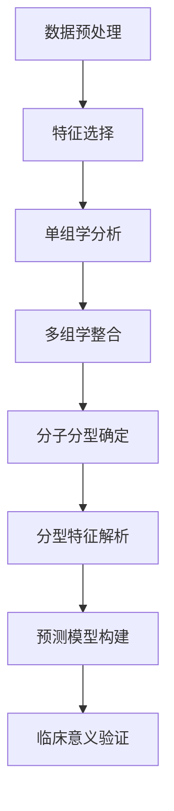

## 实验步骤



## 文件树

```python
TCGA_STAD_Classification/
│
├── data/                           # 所有数据文件
│   ├── raw/                        # 原始数据
│   │   ├── clinical/  # 临床信息文件
│   │   │   └── TCGA.STAD.sampleMap_STAD_clinicalMatrix
│   │   ├── genomic/  # 体细胞突变文件
│   │   │   └── STAD_mc3_gene_level.txt
│   │   ├── methylation/  # DNA甲基化注释文件
│   │   │   └── probeMap_illuminaMethyl450_hg19_GPL16304_TCGAlegacy
|   |   |   └── HumanMethylation450
│   │   ├── expression/  # RNA expression 基因表达文件
│   │   │   └── HiSeqV2
│   │   ├── mirna/  # miRNA表达文件
│   │   │   └── miRNA_HiSeq_gene
│   │   ├── cnv/  # 拷贝数变异文件
│   │   │   └── GISTIC2_COPYNUMBER_GISTIC2_ALL_THRESHOLDED.BY_GENES
│   │   ├── proteomics/  # 蛋白质表达数据文件
│   │   │   └── [RPPA数据文件]
│   │   └── survival/  # 生存信息文件 （在clinical_preprocessing.py中预处理）
│   │       └── SURVIVAL_STAD_SURVIVAL.TXT
│   │
│   └── processed/                  # 预处理后的数据
│       ├── clinical_processed.csv  # 临床信息（包括survival）
|       ├── mutation # 体细胞突变
│       |      ├── mutation_matrix.csv  
|       |      └── mutation_burden.csv  # 突变负荷
|       ├── methylation  # DNA甲基化
│       |      ├── methylation_filtered.csv  
|       |      └── methylation_filtered_cg_only.csv # 甲基化探针
|       ├── expression # RNA expression 基因表达
│       |      ├── expression_filtered.csv  # 表达矩阵
|       |      └── gene_std_values.csv  # 基因变异度
|       ├── mirna # mirna表达
│       |      ├── mirna_filtered.csv  # 高变异miRNA表达矩阵
|       |      └── mirna_std_values  # miRNA的标准差
|	    ├── cnv # 拷贝数变异
│       |	   ├── cnv_processed.csv # 样本×基因矩阵
|       |      ├── msi_cnv_patterns.csv # MSI状态差异
|       |      ├── cnv_focal_events.csv # 局部事件
│       |	   └── cnv_frequency.csv # 基因变异频率
|	    ├── protein  # 蛋白质组
│       |      ├── protein_filtered.csv  # 蛋白质表达矩阵
│       |	   └── protein_std_values.csv  # 蛋白质变异度
│       └── integrated_features.csv
│
├── src/                            # 源代码
│   ├── preprocessing/
│   │   ├── clinical_preprocessing.py  # 临床信息文件
│   │   ├── mutation_preprocessing.py  # 处理体细胞突变数据文件
│   │   ├── methylation_preprocessing.py  # DNA甲基化注释文件
|   |   ├── methylation_fix.py  # DNA甲基化注释文件
│   │   ├── expression_preprocessing.py  # RNA expression 基因表达文件
│   │   ├── mirna_preprocessing.py  # miRNA表达文件
│   │   ├── cnv_preprocessing.py  # 拷贝数变异文件
│   │   ├── proteomics_preprocessing.py  # 蛋白质表达数据文件
│   │
│   ├── feature_selection/
│   │   ├── variance_filter.py  # 基于方差过滤低变异特征
│   │   ├── mad_selection.py # 使用中位数绝对偏差选择特征
│   │   └── correlation_filter.py  # 移除高度相关的冗余特征
│   │
│   ├── clustering/
│   │   └── single_omics_clustering.py # 单组学聚类分析
│   │
│   ├── integration/ 
│   │   ├── multi_omics_integration.py # 多组学整合
│   │   ├── advanced_clustering.py # 多种方法聚类分析
│   │   └── molecular_subtyping_analysis.py # 分子亚型分析
│   │
│   └── modeling/
│   │   └── subtype_predictor.py 
│   │
│   └── evaluation/
│       └──evaluate_subtypes.py
│   
├── results/                        # 结果输出
│   └── ......
│   
├── environment.yml                 # 环境配置
├── README.md                       # 项目说明
└── main.py                         # 主执行脚本
```


## 数据预处理

- clinical_preprocessing.py ：临床信息


- mutation_preprocessing.py   处理体细胞突变数据


- 甲基化处理

methylation_preprocessing.py


methylation_fix.py


- mirna_preprocessing.py ：mirna表达


- expression_processing.py


- cnv_processing.py :拷贝数变异


- proteomics_preprocessing.py：蛋白质组数据预处理


## 特征选择

### 方差


### 中位数绝对偏差


### 相关性特征


## 单组学聚类分析


## 多组学整合（排除蛋白质组数据）


## 亚型分析

advanced_clustering.py 


molecular_subtyping_analysis.py

~~~bash
python src/integration/molecular_subtyping_analysis.py --subtypes_file=results/advanced_clustering/final_subtypes.csv
~~~


### 亚型特征评估

#### 亚型0（301样本）- 可能对应GS(基因组稳定型)或MSS/EMT亚型

- **临床特征**：生存率相对较低(41.2%)，高晚期比例(53.8%)
- **分子特点**：间质相关基因(FBLN1、CCL19)高表达，染色体缺失(FHIT、FOXP1)
- **生物学解释**：间质特征暗示可能具有侵袭性，基因拷贝数变异暗示染色体重排

#### 亚型1（5样本）- 可能是MSI-H特征亚型的一个子集

- **临床特征**：最高的MSI-H比例(40%)，预后较好(仅20%死亡)
- **分子特点**：具有独特的扩增谱，包含部分拷贝数变异
- **生物学解释**：样本量太小难以确定，但高MSI状态通常与免疫反应和较好预后相关

#### 亚型2（16样本）- 可能对应TCGA的CIN亚型

- **临床特征**：预后最佳(18.8%死亡)，最低的晚期比例(31.2%)
- **分子特点**：TP53突变，上皮相关基因(DSG3)高表达，最低MSI-H比例(6.2%)
- **生物学解释**：TP53突变是CIN亚型的特征，低MSI率与染色体不稳定型一致

#### 亚型3（42样本）- 可能对应TCGA的MSI亚型

- **临床特征**：较高的MSI-H比例(23.8%)，高晚期比例(54.8%)
- **分子特点**：PIK3CA和ERBB4突变，ROS1表达增高
- **生物学解释**：PIK3CA突变与MSI亚型相关，可能具有独特的信号通路激活

### 整体评价

这个分型结果与现有胃癌分型系统有良好对应：

- **与TCGA分型对比**：识别出了与CIN、MSI和GS类似的亚型
- **与ACRG分型对比**：捕捉到MSI和MSS/EMT等特征

虽然亚型1样本偏少，但整体上这个分型结果具有良好的生物学意义和临床相关性。显示了不同亚型在生存率、MSI状态和分子特征上的明显差异

## 分型模型搭建

subtype_predictor.py 


### 用训练好的模型进行新数据的预测

~~~python
#!/usr/bin/env python
# -*- coding: utf-8 -*-

"""
新样本预测示例脚本
用途：展示如何使用训练好的模型预测新样本的分子亚型
"""

import pandas as pd
import numpy as np
import pickle
from pathlib import Path
import sys

# 设置项目路径
PROJECT_ROOT = Path(__file__).parent.parent.parent
PREDICTION_DIR = PROJECT_ROOT / "results" / "prediction_models"

# 将预测模型目录添加到系统路径
sys.path.append(str(PREDICTION_DIR))

def load_model_and_scaler():
    """加载模型和数据预处理器"""
    model_path = PREDICTION_DIR / "SVM_model.pkl"
    scaler_path = PREDICTION_DIR / "scaler.pkl"
    
    try:
        with open(model_path, 'rb') as f:
            model = pickle.load(f)
        
        with open(scaler_path, 'rb') as f:
            scaler = pickle.load(f)
        
        return model, scaler
    except Exception as e:
        print(f"加载模型或预处理器时出错: {e}")
        return None, None

def load_feature_list():
    """加载模型所需的特征列表"""
    feature_file = PREDICTION_DIR / "selected_model_features.csv"
    
    try:
        features_df = pd.read_csv(feature_file)
        feature_list = []
        
        for _, row in features_df.iterrows():
            feature_name = f"{row['omics_type']}_{row['feature']}"
            feature_list.append(feature_name)
        
        return feature_list
    except Exception as e:
        print(f"加载特征列表时出错: {e}")
        return None

def load_test_data():
    """加载测试数据（示例：使用部分训练数据）"""
    data_file = PREDICTION_DIR / "model_training_data.csv"
    
    try:
        data = pd.read_csv(data_file)
        
        # 提取特征和标签
        X = data.drop(columns=['subtype'])
        y = data['subtype']
        
        # 仅使用少量样本作为示例
        sample_indices = np.random.choice(len(X), min(5, len(X)), replace=False)
        X_sample = X.iloc[sample_indices]
        y_sample = y.iloc[sample_indices]
        
        return X_sample, y_sample
    except Exception as e:
        print(f"加载测试数据时出错: {e}")
        return None, None

def simulate_new_patient_data(feature_list):
    """模拟新患者数据"""
    # 从训练数据中随机选择样本
    X_sample, _ = load_test_data()
    
    if X_sample is None or len(X_sample) == 0:
        print("无法创建模拟数据")
        return None
    
    # 选择一个样本并添加随机变异
    patient_data = X_sample.iloc[0].copy()
    
    # 模拟一些数据缺失和变异
    for feature in np.random.choice(feature_list, 10, replace=False):
        if np.random.random() < 0.3:
            patient_data[feature] = np.nan  # 缺失值
        else:
            patient_data[feature] *= (1 + np.random.normal(0, 0.1))  # 随机变异
    
    return pd.DataFrame([patient_data])

def predict_patient_subtype(patient_data, model, scaler, feature_list):
    """预测新患者的分子亚型"""
    try:
        # 确保数据包含所有需要的特征
        missing_features = [f for f in feature_list if f not in patient_data.columns]
        for feature in missing_features:
            patient_data[feature] = 0  # 对缺失特征填0
        
        # 处理缺失值
        patient_data = patient_data.fillna(0)
        
        # 确保特征顺序正确
        X = patient_data[feature_list]
        
        # 标准化
        X_scaled = scaler.transform(X)
        
        # 预测
        prediction = model.predict(X_scaled)
        probabilities = model.predict_proba(X_scaled)
        
        return prediction, probabilities
    except Exception as e:
        print(f"预测时出错: {e}")
        return None, None

def main():
    print("胃癌分子亚型预测示例")
    
    # 1. 加载模型和预处理器
    model, scaler = load_model_and_scaler()
    if model is None or scaler is None:
        return
    
    # 2. 加载特征列表
    feature_list = load_feature_list()
    if feature_list is None:
        return
    
    print(f"模型使用{len(feature_list)}个特征进行预测")
    
    # 3. 模拟新患者数据
    print("\n生成模拟患者数据...")
    patient_data = simulate_new_patient_data(feature_list)
    if patient_data is None:
        return
    
    # 4. 预测亚型
    print("\n预测患者分子亚型...")
    prediction, probabilities = predict_patient_subtype(patient_data, model, scaler, feature_list)
    
    if prediction is not None:
        print(f"\n预测亚型: {prediction[0]}")
        print("\n各亚型概率:")
        for i, prob in enumerate(probabilities[0]):
            print(f"  亚型 {i}: {prob:.4f} ({prob*100:.1f}%)")
        
        # 5. 展示亚型特征
        print("\n患者所属分子亚型的特征:")
        try:
            with open(PROJECT_ROOT / "results" / "molecular_subtypes" / "molecular_subtype_descriptions.txt", "r", encoding='utf-8') as f:
                descriptions = f.read().split("\n\n")
            
            for desc in descriptions:
                if desc.startswith(f"分子亚型 {prediction[0]}"):
                    print(desc)
                    break
        except:
            print("  无法加载亚型描述")
            
        print("\n预测完成！在实际应用中，可以根据预测结果为患者提供个性化治疗建议。")

if __name__ == "__main__":
    main()
~~~

## 模型评估

evaluate_subtypes.py


